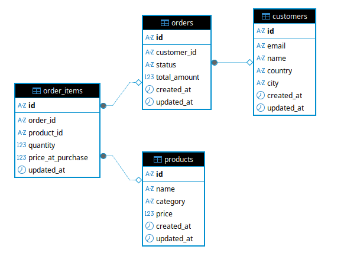
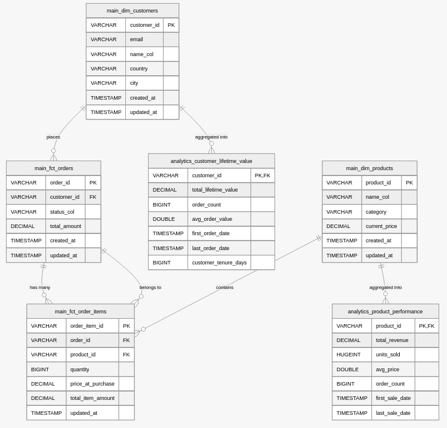
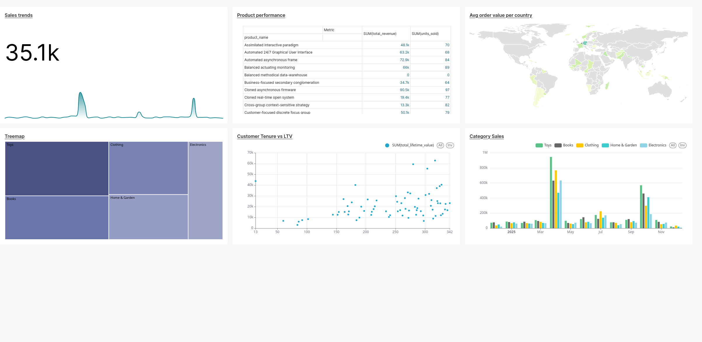

## Portable Data Stack

This application is a containerized Analytics suite for an imaginary e-commerce company.

## Stack

- Bruin
- Superset
- PostgreSQL
- DuckDB
- Docker (Docker Compose)
- Python

## Data Model

OLTP (input data)

OLAP (Data Warehouse)

## For other stacks, check the below:

- [portable-data-stack-dagster](https://github.com/cnstlungu/portable-data-stack-dagster)
- [portable-data-stack-mage](https://github.com/cnstlungu/portable-data-stack-mage)
- [portable-data-stack-airflow](https://github.com/cnstlungu/portable-data-stack-airflow)
- [portable-data-stack-sqlmesh](https://github.com/cnstlungu/portable-data-stack-sqlmesh)

### System requirements
* [Docker](https://docs.docker.com/engine/install/)

## Setup

1. Rename `.env.example` file to `.env` and set your desired credentials. Remember to never commit files containing credentials or any other sensitive information.

2. Rename `shared/db/datamart.duckdb.example` to `shared/db/datamart.duckdb` or init an empty database file there with that name.

3. With **Docker Engine** installed, change directory to the root folder of the project (also the one that contains docker-compose.yml) and run

    `docker compose up --build`

    Note that this may take several minutes to complete. Check out the console to see the progress.

4. When the assets have been materialized, you can open the [Superset interface](http://localhost:8088). Open the dashboard to see the charts.

### Demo Credentials

Demo credentials are set in the .env file mentioned above. 

### Ports exposed locally

* Superset: 8088
* OLTP Database: 54320

### General flow

1. Generate dummy data using Python and Faker

> **_NOTE:_**  The data is fictional and automatically generated. Any similarities with existing persons, entities, products or businesses are purely coincidental.

2. Insert the data into the OLTP Postgres database

3. Model data, build fact and dimension tables, load the Data Warehouse using SQL assets

4. Analyze and visually explore the data using [Superset interface](http://localhost:8088) or directly query the DuckDB database file `shared/db/datamart.duckdb`

> **_NOTE:_**  For superset, the default credentials are: user = admin, password = admin

5. You can also attach a shell to the bruin container and run [bruin CLI](https://getbruin.com/docs/bruin/) commands there

## Overview of architecture

The Docker process will begin building the application suite. The suite is made up of the following services, each within its own docker container:
* **generator**: this is a Python script that will generate, insert and export the example data
* **bruin**: the data platform
* **superset**: this contains the web-based Business Intelligence application we will use to explore the data; exposed on port 8088.
* **oltp**: the OLTP database (Postgres)